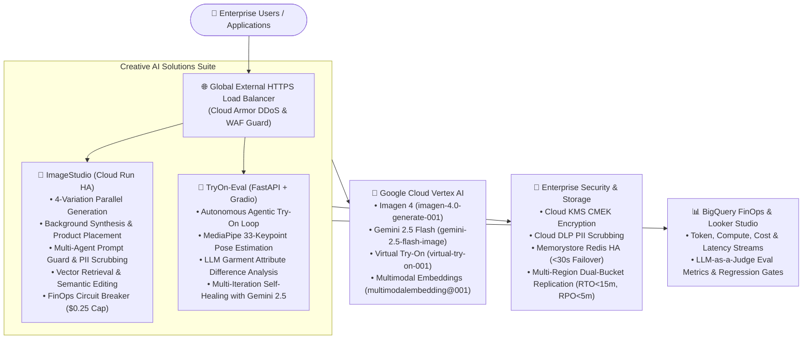

# 🎨 ImageSense: AI-Powered Creative Image Studio & Agentic Virtual Try-On

An enterprise-grade generative AI suite featuring **Image Studio** (multimodal image generation, background synthesis, product placement, watermark overlay, and typography) and **TryOn-Eval** (autonomous agentic virtual try-on with automated self-healing and pose/garment evaluation), powered by **Google Cloud Vertex AI** (Imagen 4, Gemini 2.5 Flash, Virtual Try-On) and Google Cloud Ingress Infrastructure.

---

## 🌟 Solution Architecture Overview



---

## 📂 Repository Structure

```
.
├── ImageStudio/                            # Production Creative Image Studio Suite
│   ├── app.py                              # Gradio Web Application & Multi-Agent Orchestrator
│   ├── ImageStudio.ipynb                   # Interactive Jupyter Notebook version
│   ├── Dockerfile                          # Multi-zone Cloud Run container definition
│   ├── agents-cli-manifest.yaml            # Google Agents CLI manifest
│   ├── requirements.txt                    # Python dependencies
│   ├── fonts/                              # TrueType typography fonts
│   ├── config/
│   │   └── agent_manifest.json             # Versioned agent topologies & A/B experiment config
│   ├── tools/
│   │   ├── experiment_manager.py           # A/B testing & deterministic traffic splitting
│   │   └── agent_admin_cli.py              # Operational administration CLI
│   ├── eval/
│   │   ├── eval_dataset.json               # Golden benchmark evaluation dataset
│   │   ├── eval_judge.py                   # LLM-as-a-Judge multimodal evaluator (Gemini 2.5)
│   │   ├── run_eval.py                     # Automated eval runner & CI/CD regression detector
│   │   └── README.md                       # Quality Flywheel & LLM Ops documentation
│   ├── tests/
│   │   └── resilience_and_chaos_test.py    # Chaos, failure injection & resilience test suite
│   ├── finops/
│   │   └── README.md                       # Looker Studio FinOps dashboard setup & KPIs
│   ├── deployment/
│   │   ├── cloud-armor-ingress/            # Cloud Armor, CMEK, Redis HA & Ingress Terraform
│   │   ├── cloudbuild-security-scan.yaml   # CI/CD Policy-as-Code (checkov, tfsec, tflint)
│   │   └── terraform/                      # 7 Decoupled Modules & Dev/Prod Environments
│   └── README.md                           # Detailed ImageStudio documentation
│
├── TryOn-Eval/                             # Autonomous Agentic Virtual Try-On & Auto-Eval Suite
│   ├── server.py                           # High-throughput FastAPI Web Application Backend
│   ├── app.py                              # Interactive Gradio Evaluation Interface
│   ├── Dockerfile                          # Container definition with MediaPipe models & healthchecks
│   ├── config.yaml                         # Production Vertex AI model & project configuration
│   ├── requirements.txt                    # Pinned production Python dependencies
│   ├── utils.py                            # Dynamic environment variable loader
│   ├── vto/
│   │   ├── agentic_vto.py                  # Agentic self-healing loop & multimodal recovery
│   │   ├── virtual_try_on.py               # Vertex AI Virtual Try-On API wrapper
│   │   ├── pose_estimator.py               # MediaPipe Pose Landmark visualizer & metric calculator
│   │   └── garment_diff_analyzer.py        # Gemini Multimodal garment attribute diff analyzer
│   ├── webapp/                             # Web Application Frontend (HTML, CSS, JS)
│   ├── assets/                             # Sample person and garment reference imagery
│   └── tests/                              # Unit, integration, and response quality tests
└── README.md                               # Root repository documentation
```

---

## 🚀 Key Modules & Capabilities

### 1. 🎨 Image Studio (`ImageStudio/`)
* **Parallel Image Synthesis**: Generates 4 high-fidelity images simultaneously via multi-threaded Vertex AI requests (`imagen-4.0-generate-001`, `gemini-2.5-flash-image`).
* **Background Synthesis & Compositing**: Isolates foreground products (`rembg` U2Net ONNX) and composites them onto generated contextual scenes.
* **Watermarking & Typography**: Alpha watermarking and TrueType text rendering with LRU cache.
* **Collaborative Multi-Agent Architecture**: 7 discrete agents coordinating Prompt Guard, PII Scrubbing, Semantic Vector Retrieval, Image Generation, Vision Safety, and Indexing Memory.
* **FinOps Governance**: Real-time BigQuery telemetry streaming and automated **$0.25 USD session budget circuit breaker**.
* **Enterprise High Availability**: 3-zone Cloud Run HA, Memorystore Redis HA (<30s failover), and cross-region GCS replication (RTO < 15m, RPO < 5m).

### 2. 👗 TryOn-Eval (`TryOn-Eval/`)
* **Autonomous Agentic Try-On Loop**: Combines Vertex AI Virtual Try-On (`virtual-try-on-001`) with Gemini Multimodal (`gemini-2.5-flash-image`) to iteratively refine output outfits.
* **Auto-Evaluation & Self-Healing**: Continuously assesses MediaPipe 33-point pose landmark similarity and garment attribute consistency until reaching **Pose Similarity > 0.90** and **0 Attribute Differences**.
* **Interactive Web Application & Gradio**: Features both a high-throughput FastAPI streaming backend and a Gradio interface with iteration gallery inspector.

---

## ☁️ Deployment & Ingress Security

### 1. Deploy Image Studio to Cloud Run
```bash
cd ImageStudio
agents-cli deploy --project gdc-ai-playground --region us-central1 --no-confirm-project
```

### 2. Deploy TryOn-Eval to Cloud Run
```bash
cd TryOn-Eval
agents-cli deploy --project gdc-ai-playground --region us-central1 --no-confirm-project
```

### 3. Provision Cloud Armor & Global Load Balancing (IaC)
```bash
cd ImageStudio/deployment/cloud-armor-ingress
./deploy-ingress.sh gdc-ai-playground us-central1
```

---

## 🧪 Testing & Validation

### Run Chaos & Resilience Test Suite
```bash
python ImageStudio/tests/resilience_and_chaos_test.py
```

### Run LLM Ops Evaluation Benchmark
```bash
python ImageStudio/eval/run_eval.py
```

---

## 👤 Author
* **Bhushan Garware**
